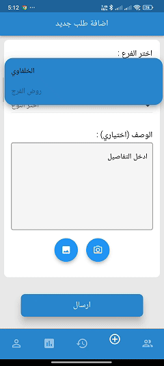
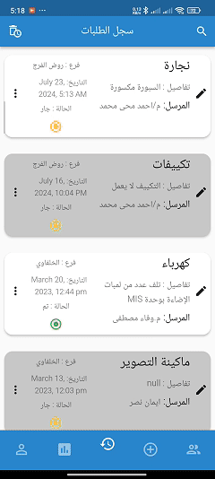
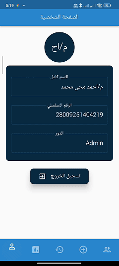
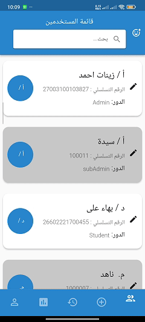
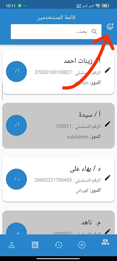
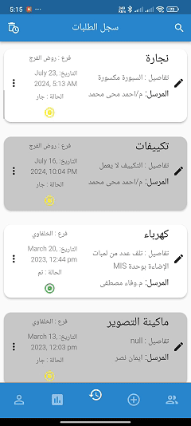
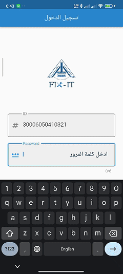

# FixIT App

FixIT App was created for the Faculty of Engineering in Shubra in Egypt.
To maintain faults within the college by creating a problem and entering all its details in terms of the building, floor, room, type of fault, uploading a picture of the fault, etc.
Then this problem is assigned to the specialized maintenance technician, and after the problem is repaired by the technician, the status of the problem being resolved is updated

## For Admin:

### Features:
1. Create a new repair request and specify the branch, building, floor, hall or room, type of problem, description and photo.

  

2. View a list of repair requests. The request can be deleted and restored from the recycle bin and show all the request information such as start date, repair date if resolved, and other information that was added when the request was created.

  

3. The repair request can be assigned to a specific specialized technician or to more than one technician so that it appears in the maintenance technicians’ accounts.

  

4. Statistics page and flowchart drawing Example: Comparing the number of problems between the two branches, the problems that were fixed or not, and the number of problems each day.

  

5.  View list of users in app with all info and can delete any user or edit it and can search by text.

  

6. Create a new technician and define his specialty.

  

7. Filter a list of repair requests by branch, building, type of problem, solved or not.

  

## For Maintenance Technicians

### Features:
1.  The repair requests assigned to him by the administrator are displayed to him, not all requests.
After fixing the problem, the order status can be updated to Done and the repair date is added to the request information.

  

